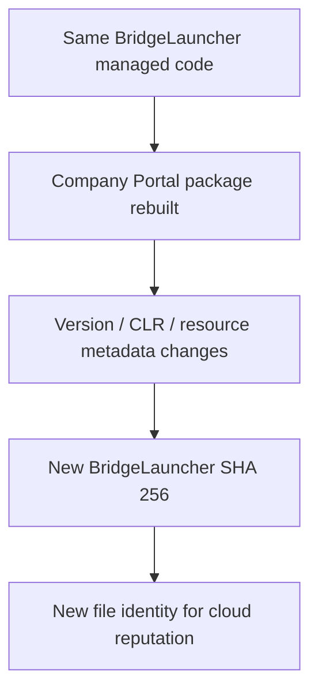

# BridgeLauncher history: Company Portal 11.2.1952.0 through 11.2.2044.0

## Why this comparison matters

The ASR block observed on `11.2.2044.0` targets `BridgeLauncher.exe` under the rule `Block executable files from running unless they meet a prevalence, age, or trusted list criterion`. The five packages now available let us separate file identity changes from launcher code changes.

## Direct comparison

| Company Portal | Size | SHA 256 | Target framework metadata | Embedded Authenticode directory | Managed code region SHA 256 |
| --- | ---: | --- | --- | ---: | --- |
| `11.2.1952.0` | `12,288` | `309950bfe790e5b42034caa503efaa0936105c742930b947d985f02cc8eee725` | `.NET Framework 4.8` | `0 bytes` | `ff703e68626e715cde0898ee1f197b0fab6a7e919a6245d08577af924c08f8b6` |
| `11.2.2021.0` | `12,288` | `2e6786057ec2204e1c2b00096a4928103a4ce7b814b9e66d6b5991bad3927607` | `.NET Framework 4.8` | `0 bytes` | `ff703e68626e715cde0898ee1f197b0fab6a7e919a6245d08577af924c08f8b6` |
| `11.2.2035.0` | `12,288` | `51e65c20231b96f3fa593cb56400daea48d211f14919cd343f3b17f2027f6f6f` | `.NET Framework 4.7.2` | `0 bytes` | `ff703e68626e715cde0898ee1f197b0fab6a7e919a6245d08577af924c08f8b6` |
| `11.2.2037.0` | `12,288` | `cb68332b6bb0607a731e3fb14336d602a9a16fb157a750c2b0f78d75364f30c2` | `.NET Framework 4.8` | `0 bytes` | `ff703e68626e715cde0898ee1f197b0fab6a7e919a6245d08577af924c08f8b6` |
| `11.2.2044.0` | `12,288` | `950309be1806fa168ffb917cd121f507d856b124661bbcc7b1cfe65cc95618d7` | `.NET Framework 4.7.2` | `0 bytes` | `ff703e68626e715cde0898ee1f197b0fab6a7e919a6245d08577af924c08f8b6` |

The key result is unusually clean: the managed code region hash is identical in all five packages. The executable stays at `12,288` bytes. Yet the whole file hash changes every time.

The framework metadata follows this sequence:

```text
1952   .NET Framework 4.8
2021   .NET Framework 4.8
2035   .NET Framework 4.7.2
2037   .NET Framework 4.8
2044   .NET Framework 4.7.2
```

The PE security directory is zero in every copy, so none of these `BridgeLauncher.exe` files carries an embedded Authenticode signature. They are shipped inside a signed APPX package.

## What actually changes

For `1952 -> 2021`, only `54` bytes in the complete 12 KB launcher differ. The managed code bytes are identical. The differences are build/version metadata and resources.

For the later versions, the target framework metadata and other CLR/build metadata also move, but the managed code region remains identical.

That means the launcher behavior itself is not the reason `2044` suddenly looks different to ASR. From the file reputation point of view, however, every release is a new file hash.



## Important limitation

This proves that the managed launcher code shipped in these five x64 packages is identical. It does not expose Microsoft's internal Defender prevalence, age, or trusted list score for each hash. The Defender event and Advanced Hunting data are still required to prove which reputation criterion caused a specific block.

## Bottom line

Across `1952`, `2021`, `2035`, `2037`, and `2044`, `BridgeLauncher.exe` is repeatedly rebuilt into a new file hash while its managed launcher code stays byte identical. That is exactly the distinction needed for the ASR investigation: code behavior is stable, file identity is not.