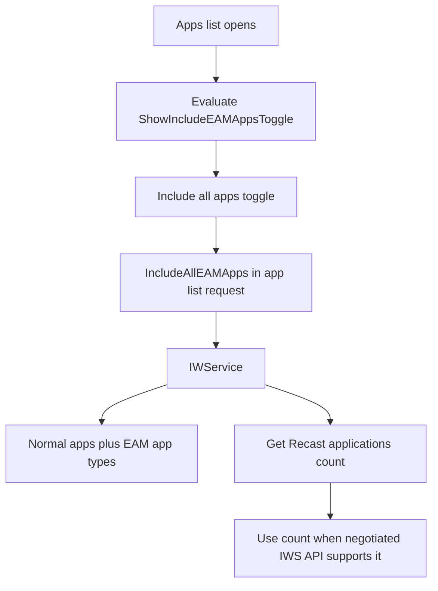
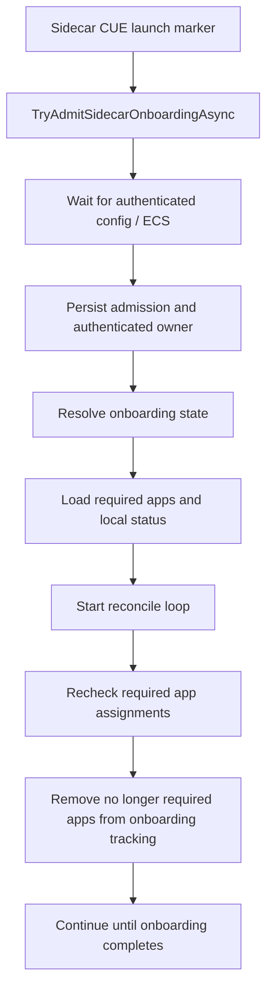

# company-portal-11.2.2021.0-to-11.2.2035.0

## Scope

This document describes the direct package changes between `11.2.2021.0` and `11.2.2035.0`.

Evidence sources: direct extraction of both APPXBUNDLEs and their x64 APPX payloads, exact SHA 256 inventory, APPX manifest comparison, package file sizes, compiled XAML runtime metadata, `resources.pri`, printable binary strings, and managed bridge metadata. The x64 package is used for the detailed comparison because the functional payload is duplicated across architectures. `CompanyPortal.dll` is .NET Native, so this report does not claim ordinary managed IL control flow for that binary.

Presence of a code path does not prove that it is enabled for every tenant. Company Portal uses server configuration, feature flighting, and negotiated service contracts.

## Executive summary

`11.2.2035.0` is a major Company Portal build. The installation deadline work is only one part of it. Four larger feature or architecture lines are visible in the package.

First, Company Portal gains an EAM/Recast aware All Apps path. It adds an `Include all apps` toggle, sends an `includeAllEAMApps` query parameter to IWService, understands `EamStatic`, `EamAutoUpdate`, and `EamRecast`, and can retrieve a separate Recast application count when the negotiated IWService API supports it.

Second, the CUE onboarding implementation becomes substantially stricter and more resilient. Company Portal adds explicit Sidecar admission, persists the admission owner, can resume and revalidate it after authentication/ECS is available, rejects serialized CUE arguments unless the exact Sidecar marker is present, and adds a reconciliation loop for required apps that disappear or change while onboarding is in progress.

Third, the newer IME StatusService contract introduces `AppInstallStatus3`, category/substatus, negotiated session versions, and installation deadline data. This is the source of the `Downloaded for future installation` UX.

Fourth, the Configuration Manager path gains security hardening around HTTPS fallback, credential exposure, certificate hostname checks, and validation against SCCM issuing certificates.

There are also search/accessibility XAML changes and the package minimum Windows version moves from `10.0.18362.0` down to `10.0.17763.0`.

## Package level changes

| Property | 11.2.2021.0 | 11.2.2035.0 |
| --- | ---: | ---: |
| APPXBUNDLE size | `77,903,082` | `78,976,286` |
| x64 APPX size | `19,773,496` | `20,060,885` |
| x64 extracted size | `53,810,574` | `54,562,921` |
| x64 file count | `271` | `271` |
| Added files | `0` | `0` |
| Removed files | `0` | `0` |
| Files with changed SHA 256 |  | `80` |
| `CompanyPortal.dll` | `39,243,776` | `39,955,968` |
| `resources.pri` | `968,688` | `970,648` |
| `Core/Core.xr.xml` | `79,445` | `79,565` |
| `Navigation/Navigation.xr.xml` | `11,276` | `12,030` |
| Windows minimum version | `10.0.18362.0` | `10.0.17763.0` |

APPXBUNDLE SHA 256:

`11.2.2021.0`: `876c09142edccc9fafe0d8894995a20824f6b3cb9c55944233ea215544320a36`

`11.2.2035.0`: `b7a7930a8380ded8f24e023af1a320b131396a34efc26d0400d38a78227b83a2`

`CompanyPortal.dll` SHA 256:

`11.2.2021.0`: `0d335d63a2d1f2d930740a3ab15d8f4cbe534ddb3b479660cb575803d3a8fab6`

`11.2.2035.0`: `4b2b52ae0a4904e595c7867f4938011ea69402a0951b516f12bd94da773df2ad`

## 1. EAM/Recast becomes part of the All Apps pipeline

This is a real feature line separate from the deadline work. New Company Portal symbols and log strings include:

```text
IncludeAllEAMApps
IncludeAllEamApps
ShowIncludeEAMAppsToggle
ShowIncludeAllAppsToggle
AppListIncludeAllEamAppsToggled
EamStatic
EamAutoUpdate
EamRecast
RecastAppsCount
GetRecastApplicationsCountAsync
GetOrFetchRecastAppsCountAsync
```

The REST/service library adds:

```text
IncludeAllEAMAppsQueryParameter
includeAllEAMApps
GetApplicationsCountAsync
EamStatic
EamAutoUpdate
EamRecast
```

The resource package adds:

```text
AppListing_IncludeAllApps
AppsListPage_IncludeAllAppsToggle
Include all apps
```

Visible diagnostic strings show that the Recast count depends on the negotiated IWService API:

```text
The Recast app count is unavailable because the negotiated IW Service API does not support it.
Retrieved {0} Recast applications from the IWS count request.
```

The internal name `Recast` is directly present in the binaries. This report does not assume a public product name beyond the explicit `EAM` strings.

### App list flow



## 2. CUE gains explicit Sidecar admission and reconciliation

The base CUE startup task already existed. `2035` adds a new admission layer around that architecture. New names include:

```text
SidecarOnboardingAdmitted
SidecarOnboardingAdmissionOwnerV1
TryAdmitSidecarOnboardingAsync
TryResumePersistedSidecarOnboardingAsync
RefreshDeviceAndValidatePersistedSidecarOnboardingAsync
RevalidateSidecarOnboardingAdmissionWithEcsAsync
WaitForAuthenticatedConfigAsync
ShouldKeepCurrentPageForCueLaunch
OnboardingReconcileOutcome
```

One of the clearest new strings is:

```text
Ignoring serialized CUE onboarding arguments because only the exact Sidecar marker can start onboarding.
```

The package also gains a set of `[Onboarding][Reconcile]` messages showing a background recheck loop. It can requery the required app list, remove apps that IWService no longer reports as required, avoid removing apps whose state changed while the query was in flight, and retry cleanup of temporary tracking.

### CUE admission flow



This is a substantial evolution of the `1926` CUE architecture, not merely the old startup task appearing again.

## 3. StatusService v8 and future installation deadlines

The bundled IME status library moves from the old `1.52.202.0` generation to `1.106.52.0`:

| Property | 2021 | 2035 |
| --- | ---: | ---: |
| Size | `24,984` | `28,536` |
| Target framework | `.NET Framework 4.6` | `.NET Framework 4.7.2` |

New contract members include:

```text
AppInstallStatus3
AppInstallStatusCategory
AppInstallSubstatus
VersionInfoAttribute
NegotiateSessionVersionAsync
Status3
Category
Substatus
InstallDeadlineTime
DownloadedPendingInstallDeadline
WinGetPackageNotFound
WinGetProcessTimeout
```

`IntuneManagementExtensionBridge.exe` grows from `55,296` to `57,344` bytes and gains the corresponding session negotiation and Status3 handling. `AppServices.Portable.dll` grows by `512` bytes in all five bridge folders and gains `NegotiatedSessionVersion`.

Company Portal itself adds:

```text
IApplicationInstallDeadlineProvider
GetInstallDeadlineAsync
DownloadedPendingInstallDeadline
DownloadedPendingInstallDeadlineDetails
FutureInstallationTelemetryReported
```

The matching user facing resources include:

```text
Downloaded for future installation
Downloaded successfully, will be installed on {0:g}
{0} is downloaded for future installation
```

## 4. Configuration Manager security hardening

`2035` adds a second major security line unrelated to the deadline status. New names and diagnostics include:

```text
BlockConfigurationManagerHttpsToHttpFallback
RestrictConfigurationManagerAppDescriptionLinksToWebSchemes
DisableCcmCertificateIdentityValidation
CcmIssuingSslValidator
ConfigurationManagerCredentialWithheldOverInsecureChannel
ConfigurationManagerFallbackRegistrationBlocked
```

The new strings describe several concrete protections:

```text
Fallback URL uses a less secure scheme than the primary HTTPS endpoint. Fallback registration skipped to prevent credential exposure over an unencrypted channel.
Attempt to validate custom chain against SCCM issuing certificates
SSL certificate name does not match any expected host
SSL certificate validation failed. The certificate does not chain to any of the specified SCCM issuing certificates.
```

This shows Company Portal tightening its Configuration Manager bridge/service path around HTTPS downgrade and certificate identity validation. The feature is flight aware, so static presence does not prove enforcement for every tenant/device.

## 5. Search and accessibility metadata change

The compiled XAML grows in `2035`. New runtime metadata includes:

```text
Control.Padding
StateTrigger.IsActive
AutomationProperties.AccessibilityView
RelativePanel.AlignVerticalCenterWithPanel
FontIcon
ToggleSwitch.Visibility
```

New resources include:

```text
SearchBoxDisabled
SearchBoxEnabled
SearchBoxEnabledStates
SearchGlyph
SearchGlyph.Foreground
CompanyPortalTableSeparatorBrush
CompanyTerms_PrivacyPolicyNarratorWithFormat
{0}, opens in a new tab
```

These are real UI/accessibility changes, but they are smaller than the EAM, CUE, StatusService, and Configuration Manager changes above.

## 6. Windows minimum version is lowered

The manifest moves from:

```text
10.0.18362.0
```

to:

```text
10.0.17763.0
```

`MaxVersionTested` remains `10.0.19041.0`.

## BridgeLauncher check

`BridgeLauncher.exe` receives a different file hash in this release, but the launcher logic itself does not change.

| Property | 11.2.2021.0 | 11.2.2035.0 |
| --- | --- | --- |
| File size | `12,288` | `12,288` |
| SHA 256 | `2e6786057ec2204e1c2b00096a4928103a4ce7b814b9e66d6b5991bad3927607` | `51e65c20231b96f3fa593cb56400daea48d211f14919cd343f3b17f2027f6f6f` |
| Target framework metadata | `.NET Framework 4.8` | `.NET Framework 4.7.2` |
| Embedded Authenticode security directory | `0 bytes` | `0 bytes` |
| Managed code region SHA 256 | `ff703e68626e715cde0898ee1f197b0fab6a7e919a6245d08577af924c08f8b6` | `ff703e68626e715cde0898ee1f197b0fab6a7e919a6245d08577af924c08f8b6` |

The managed code region is byte identical. The changing whole file hash comes from PE/build metadata, CLR metadata, target framework metadata where applicable, version resources, and related build output. The executable itself has no embedded Authenticode certificate table in either package. The APPX package is signed separately.

This matters for the ASR investigation because a Company Portal update can create a new `BridgeLauncher.exe` file identity and hash without changing the launcher program logic.

## Bottom line

`2035` is much bigger than the deadline feature. It simultaneously introduces the EAM/Recast All Apps path, a new Sidecar CUE admission and reconciliation architecture, StatusService v8 with deadline aware app status, and Configuration Manager transport/certificate hardening. The later `2037` build does not roll all of this back: the EAM/Recast line survives, while several of the other `2035` lines are removed.