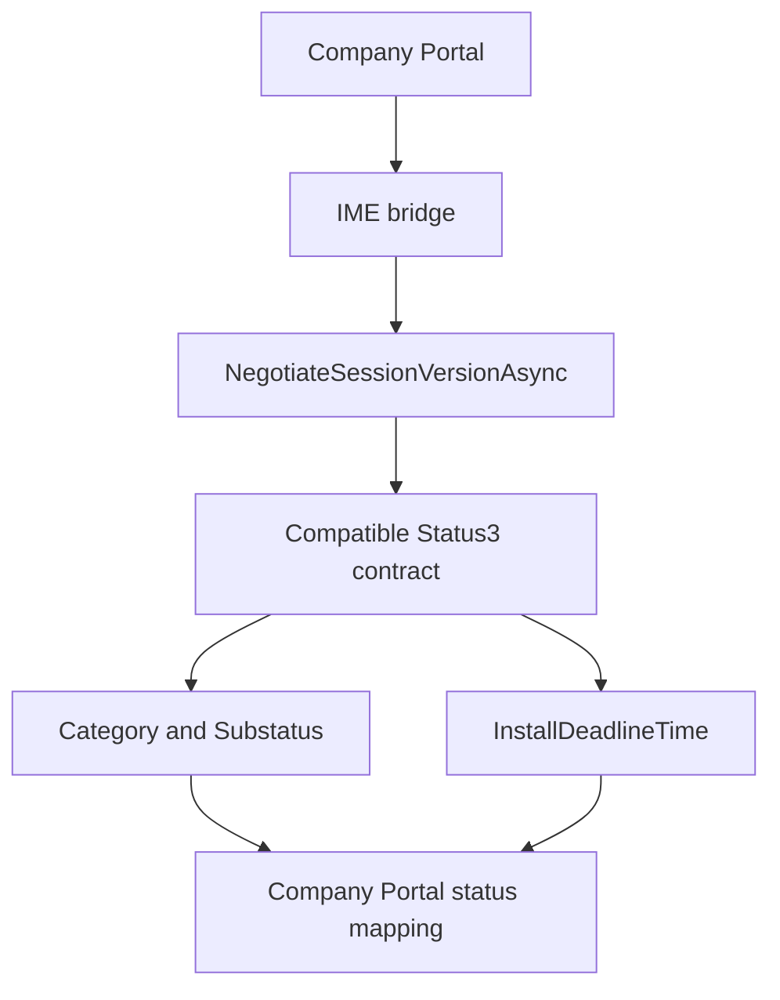

# company-portal-11.2.2037.0-to-11.2.2044.0

## Scope

This document describes the changes found between these Company Portal packages:

| Package | Version |
| --- | --- |
| Previous package | `11.2.2037.0` |
| New package | `11.2.2044.0` |

Both APPXBUNDLEs and their x64 APPX payloads were extracted and compared directly. Evidence includes APPX manifests, SHA 256 file comparison, binary sizes, compiled XAML runtime metadata, resources, managed bridge metadata, and binary strings.

The x64 package is used for the detailed code comparison because the functional payload is duplicated across architectures. Company Portal is .NET Native, so the main binary findings are based on structural and string evidence rather than normal managed IL decompilation.

## Executive summary

`11.2.2044.0` restores the richer Company Portal to IME application status feature line that was removed in `11.2.2037.0`.

The strongest evidence is unusually clean: the `StatusServiceLibrary.dll` shipped in `2044` is byte for byte identical to the one from `2035`. The newer `AppInstallStatus3`, category and substatus fields, installation deadline data, and `NegotiateSessionVersionAsync` return. The IME bridge regains the same session negotiation surface, and Company Portal regains the `DownloadedPendingInstallDeadline` handling and user facing future installation resources.

The compiled `Core.xr.xml` and `Navigation.xr.xml` files in `2044` are also byte for byte identical to `2035`, showing that the XAML feature line removed in `2037` was restored.

The Windows minimum version is lowered again from `10.0.18362.0` to `10.0.17763.0`.

`2044` is not a complete byte for byte return to `2035`. `CompanyPortal.dll` is `56,320` bytes larger than the `2035` binary and `resources.pri` is `80` bytes larger, so there are additional changes on top of the restored feature line.

## Package level changes

| Property | 11.2.2037.0 | 11.2.2044.0 |
| --- | ---: | ---: |
| APPXBUNDLE size | `78,025,583` | `79,041,353` |
| x64 APPX size | `19,810,385` | `20,086,256` |
| x64 extracted size | `53,906,137` | `54,619,391` |
| x64 file count | `271` | `271` |
| Added files | `0` | `0` |
| Removed files | `0` | `0` |
| Files with changed SHA 256 | `65` | `65` |
| `CompanyPortal.dll` | `39,310,336` | `40,012,288` |
| `resources.pri` | `969,216` | `970,728` |
| `Core/Core.xr.xml` | `79,487` | `79,565` |
| `Navigation/Navigation.xr.xml` | `11,276` | `12,030` |
| Windows minimum version | `10.0.18362.0` | `10.0.17763.0` |

APPXBUNDLE SHA 256:

`11.2.2037.0`: `7369c76bfdd443807e2086b6b6d050f81df344aeacbbd2487b28eb19cc361faa`

`11.2.2044.0`: `49aa1d4eba1e8287f9b98a93fc7ae49232aad112581c0935ef164a0699817bd9`

CompanyPortal.dll SHA 256:

`11.2.2037.0`: `e71294278c86630e025e96dce8a1fb0069152ca2d20f678c8ab0ff3591fb8dff`

`11.2.2044.0`: `8a7fe1277955359f3fd5694ce90a6d1a14a1f3bd9b1e5098ed0f56bf80b7de32`

## 1. The newer StatusService library is restored exactly

The bridge library changes from:

```text
2037: 24,984 bytes, version 1.52.202.0
2044: 28,536 bytes, version 1.106.52.0
```

More importantly, the `2044` library has the exact same SHA 256 as `2035`:

```text
c96603fc9c8313c83f9cb8cb2ad9545830bd427a2ce156e16a153ecafc02ed6c
```

The restored contract includes:

```text
AppInstallStatus3
AppInstallStatusCategory
AppInstallSubstatus
VersionInfoAttribute
NegotiateSessionVersionAsync
ContractVersion
Status3
Category
Substatus
InstallDeadlineTime
DownloadedPendingInstallDeadline
WinGetPackageNotFound
WinGetProcessTimeout
```

This is direct byte level evidence that `2044` restores the same StatusService contract generation that was present in `2035`.

## 2. Session negotiation returns to the IME bridge

`IntuneManagementExtensionBridge.exe` grows from `55,296` to `57,344` bytes.

The following members return:

```text
NegotiatedSessionVersion
AppInstallStatus3
AppInstallStatusCategory
AppInstallSubstatus
NegotiateSessionVersionAsync
get_Category
get_Substatus
get_ContractVersion
get_Status3
get_InstallDeadlineTime
set_InstallDeadlineTime
```

The shared `AppServices.Portable.dll` grows from `22,016` back to `22,528` bytes in all five local bridge locations and regains:

```text
NegotiatedSessionVersion
get_NegotiatedSessionVersion
set_NegotiatedSessionVersion
```

### Restored contract flow



## 3. Future installation status returns to Company Portal

The status concepts removed in `2037` return in `2044`:

```text
IApplicationInstallDeadlineProvider
GetInstallDeadlineAsync
InstallDeadline
InstallDeadlineTime
NegotiatedSessionVersion
DownloadedPendingInstallDeadline
DownloadedPendingInstallDeadlineDetails
FutureInstallationTelemetryReported
```

The matching resource keys return as well:

```text
AppDetails_DownloadedForFutureInstallation
AppDetails_DownloadedPendingInstallDeadline
AppInstallStatus_DownloadedPendingInstallDeadlineOne
AppInstallStatus_Tile_DownloadedPendingInstallDeadline
```

And the compiled resource text again includes:

```text
Downloaded for future installation
Downloaded successfully, will be installed on {0:g}
```

So `2044` restores both sides of the integration: the richer IME bridge contract and the Company Portal UX mapping that can consume it.

## 4. The 2035 XAML feature line is restored byte for byte

The compiled XAML files in `2044` match `2035` exactly.

`Core/Core.xr.xml` SHA 256 in both `2035` and `2044`:

```text
a46506fddc9dcd5b5d108afe9bcb9cf8dbefb631aad1511a5fd2a96712bbe1e3
```

`Navigation/Navigation.xr.xml` SHA 256 in both `2035` and `2044`:

```text
d8aad8370892ef0b02863454f4daf3fee0df6dde3a13a3db419e8f415622c7fc
```

The restored metadata includes the entries that disappeared in `2037`, including:

```text
Control.Padding
Windows.UI.Xaml.Controls.FontIcon
AutomationProperties.AccessibilityView
RelativePanel.AlignVerticalCenterWithPanel
```

The search related resources also return:

```text
CompanyPortalTableSeparatorBrush
SearchBoxDisabled
SearchBoxEnabled
SearchBoxEnabledStates
SearchGlyph
SearchGlyph.Foreground
```

That makes the rollback and restore sequence unusually easy to see across the three packages.

## 5. The Windows compatibility floor is lowered again

The manifest changes from:

```text
MinVersion="10.0.18362.0"
```

to:

```text
MinVersion="10.0.17763.0"
```

`MaxVersionTested` remains `10.0.19041.0`.

This restores the same minimum version used by `2035`.

## 6. 2044 is not simply 2035 with a new version number

Although the StatusService library and the compiled XAML files return exactly to the `2035` feature line, the whole package is not identical.

Comparing `2035` directly with `2044`:

```text
271 files in both builds
58 files have a different SHA 256
213 files are byte identical
55 of the 58 changed files have no size change
```

The meaningful size differences are concentrated in:

```text
CompanyPortal.dll   +56,320 bytes compared with 2035
resources.pri       +80 bytes compared with 2035
AppxBlockMap.xml    +70 bytes compared with 2035
```

So the best description is: `2044` restores the `2035` app status and XAML feature line, while also carrying additional main binary work that is not cleanly attributable from static strings alone.

## 7. CUE onboarding remains present

The startup task is unchanged:

```xml
<desktop:StartupTask
    TaskId="CueOnboardingAutoLaunch"
    Enabled="false"
    DisplayName="ms-resource://Microsoft.CompanyPortal/AppConstants/ApplicationName" />
```

The main image continues to contain:

```text
StartupTaskManager
IStartupTaskManager
WaitForEcsAndResolveStateAsync
ResolveOnboardingState
IsAutoLaunchAsync
```

Nothing in this transition indicates that the CUE onboarding architecture was removed.

## 8. The unified Devices page path remains

`2044` still exposes:

```text
LoadDevicesAsync
CompleteBackgroundDeviceQueryProcessing
```

The temporary `1926` local first loading split remains absent.

## Important changed payloads

The transition changes `65` x64 payload hashes without adding or removing files.

| File | 2037 | 2044 | Delta |
| --- | ---: | ---: | ---: |
| `CompanyPortal.dll` | `39,310,336` | `40,012,288` | `+701,952` |
| `StatusServiceLibrary.dll` | `24,984` | `28,536` | `+3,552` |
| `IntuneManagementExtensionBridge.exe` | `55,296` | `57,344` | `+2,048` |
| each `AppServices.Portable.dll` | `22,016` | `22,528` | `+512` |
| `resources.pri` | `969,216` | `970,728` | `+1,512` |
| `Navigation/Navigation.xr.xml` | `11,276` | `12,030` | `+754` |
| `Core/Core.xr.xml` | `79,487` | `79,565` | `+78` |

## The three build sequence


The same pattern is visible in the StatusService library, IME bridge, shared app service contract, Company Portal resources, XAML metadata, and package Windows minimum version.

## Confidence and limitations

### Direct evidence

* `2044` restores the exact `2035` StatusService library binary.
* Newer Status3 and contract negotiation members return.
* Matching Company Portal deadline status and resources return.
* Shared `NegotiatedSessionVersion` fields return.
* `Core.xr.xml` and `Navigation.xr.xml` are byte identical to `2035`.
* The Windows minimum version returns to `10.0.17763.0`.
* CUE onboarding remains.

### Interpretation

The evidence strongly supports `2044` being a restoration of the `2035` richer app status feature line after the `2037` rollback.

### Not fully attributable from static inspection

The extra `56,320` bytes in `CompanyPortal.dll` compared with `2035` show there is additional work in `2044`. The current static evidence is not enough to label every one of those extra changes without overclaiming.

## Bottom line

`11.2.2044.0` puts the richer Company Portal to IME app status path back. The exact `2035` StatusService contract returns, negotiated session version support comes back through the local bridge, Company Portal regains the future installation deadline state and its user facing resources, and the `2035` compiled XAML feature line is restored byte for byte.

It is a restoration plus additional main binary changes, not a simple repack of `2035`.
