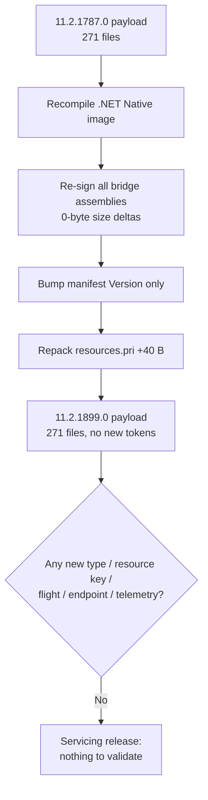

# companyportal-11.2.1787.0-to-11.2.1899.0

## Scope

This document describes the changes found between these Company Portal (`Microsoft.CompanyPortal`) packages:

| Package          | Version        |
| ---------------- | -------------- |
| Previous package | `11.2.1787.0`  |
| New package      | `11.2.1899.0`  |

Evidence sources: `.appxbundle` unpacking and `AppxBundleManifest.xml` comparison, extraction of the **x64** application `.appx` payload (chosen as the canonical architecture, mirroring how the IME reports pick the MSI), per-file SHA-256 inventory across the whole payload, `AppxManifest.xml` diffing, PE `IMAGE_FILE_HEADER` `TimeDateStamp` reads, compiled-XAML type-index (`*.xr.xml`) diffing, and ASCII **plus UTF-16LE** string extraction from `CompanyPortal.dll` with whole-identifier tokenisation.

Two caveats specific to this app, both of which shape the method:

1. **`CompanyPortal.dll` is a .NET Native (AOT) image**, not a normal ECMA-335 assembly. There are no CLR metadata table row counts to diff the way the IME assemblies allow. Type, method and resource-key names survive as strings (for reflection/serialisation), so string diffing is the primary signal, but there is no readable IL, so logic-level claims are not made.
2. **The .NET Native string blob is repacked on every build.** A naive "added/removed string" diff produces thousands of false positives, because the *same* literal is captured with a different trailing byte each build (e.g. `get_EnableOSRecovery` vs `get_EnableOSRecovery+`). Every claim below was therefore validated with a **whole-token presence count across all four versions** (absent→present transitions), not with the raw line diff.

This is an independent reverse-engineering report. Presence of code does not mean a feature is active for any given tenant — Company Portal ships a large amount of code dark and enables it through ECS (Experimentation & Configuration Service) flights.

## Executive summary

`11.2.1899.0` is a **servicing / rebuild release with no observable functional change**. The payload was recompiled and re-signed, but nothing new ships and nothing is removed.

- Every one of the 271 payload files is byte-for-byte present (no additions, no removals).
- All of the satellite bridge assemblies (`BridgeLauncher`, `ConfigurationManagerBridge`, `EpmBridge`, `IntuneManagementExtensionBridge`, `RecoveryMediaCreationTool`) changed content hash but with a **0-byte size delta** — the classic signature of a rebuild + re-sign, not a code change.
- `AppxManifest.xml` differs **only** in the `Version` attribute (`11.2.1787.0` → `11.2.1899.0`). Capabilities, extensions, protocols, app-service registrations and OS version bounds are unchanged.
- `CompanyPortal.dll` moved by −512 bytes and `resources.pri` by +40 bytes. Token-level analysis of `CompanyPortal.dll` finds the **only** namespace-level change is the embedded build path (`CompanyPortal.pdb` under a new `PkgProc` GUID). No new type names, resource keys, flight names, endpoints or telemetry events appear.

If you maintain a change tracker, this entry exists mainly to record the rebuild and the ~3-month gap between the two builds; there is no behaviour to test.

## Package-level changes

| Property             | 11.2.1787.0                          | 11.2.1899.0                          |
| -------------------- | ------------------------------------ | ------------------------------------ |
| Bundle version       | `11.2.1787.0`                        | `11.2.1899.0`                        |
| Publisher            | `CN=Microsoft Corporation, …`        | same                                 |
| PE build timestamp   | 2026-03-26 11:04:08 UTC              | 2026-07-04 10:00:57 UTC              |
| `.appxbundle` size   | 76,792,288 bytes                     | 76,791,405 bytes                     |
| x64 `.appx` size     | 19,486,505 bytes                     | 19,486,853 bytes                     |
| `CompanyPortal.dll`  | 38,489,088 bytes                     | 38,488,576 bytes (−512)              |
| `resources.pri`      | 963,792 bytes                        | 963,832 bytes (+40)                  |
| Payload file count   | 271                                  | 271 (+0 / −0)                        |
| Min OS / MaxTested   | 10.0.18362.0 / 10.0.19041.0          | same                                 |

Architectures in the bundle (unchanged): `x86`, `x64`, `arm`, `arm64`, plus language and scale resource packs.

## Changed files (x64 payload)

57 files changed content hash; **all** with either a 0-byte or single-digit-byte delta.

| File                                                     | Delta   | Interpretation                         |
| -------------------------------------------------------- | ------- | -------------------------------------- |
| `CompanyPortal.dll`                                      | −512 B  | recompile; only PDB path string differs |
| `resources.pri`                                          | +40 B   | resource index re-pack                 |
| `AppxManifest.xml`                                       | 0 B     | version attribute only                 |
| `AppxSignature.p7x`, `AppxBlockMap.xml`, `CodeIntegrity.cat` | 0 B  | re-sign                                |
| all `BridgeLauncher/*`, `ConfigurationManagerBridge/*`, `EpmBridge/*`, `IntuneManagementExtensionBridge/*`, `RecoveryMediaCreationTool/*` DLLs and EXEs | 0 B each | rebuild + re-sign, no size change |

No `.xr.xml` (compiled-XAML type index) changed — meaning no XAML type registrations were added or removed, a strong corroboration that the UI surface is identical.

## 1. Why this is a no-op, in detail

The `AppxManifest.xml` diff is the whole story:

```
- <Identity Name="Microsoft.CompanyPortal" … Version="11.2.1787.0" ProcessorArchitecture="x64" />
+ <Identity Name="Microsoft.CompanyPortal" … Version="11.2.1899.0" ProcessorArchitecture="x64" />
```

Nothing else in the manifest moves. The full-trust process registration, the `companyportal:` protocol handler, the `windows.appService` and `windows.appUriHandler` extensions, and the `runFullTrust` / `enterpriseAuthentication` / `sharedUserCertificates` / `packageQuery` capabilities are all identical.

Inside `CompanyPortal.dll`, the whole-token set gained exactly one namespace-qualified string versus `11.2.1787.0` — the shipped PDB path:

```
F:\Data\PkgProc\<new-GUID>\ExtractedBundle\CompanyPortal-Universal-Production_x64\CompanyPortal.pdb
```

Every feature token that could indicate change is **flat across both builds**: the Win11 redesign controls (`RedesignControls`/`RedesignPages`, gated by `EnableWin11Redesign`), OS-recovery media creation (`OSRecoveryProfiles`, `EnableOSRecovery`), intelligent search (`IntelligentSearch.SearchResults`), the featured-apps hub (`FeaturedHub`), restorable apps, and the BitLocker recovery-key surface all have identical token counts in both packages. These features were already present in `11.2.1787.0` (shipped dark behind flights) and are equally present, unchanged, here.



## Evidence and confidence

### High confidence (directly observed)

- No files added or removed; 271 → 271.
- Manifest differs only by `Version`.
- Every bridge assembly changed hash at a 0-byte size delta (rebuild/re-sign).
- No `*.xr.xml` changed (no XAML type registration change).
- The only new CompanyPortal-namespace string is the PDB build path.
- Flight-gated feature token counts (redesign / OS recovery / search / featured hub / restorable apps / BitLocker keys) are identical across both builds.

### Inferred, not confirmed

- The −512 B / +40 B movements in `CompanyPortal.dll` / `resources.pri` are attributed to normal compiler/index repacking. Without readable IL this cannot be proven to be behaviourally inert, but no readable string, type or resource evidence of a change exists.

### Flight or server dependent

- Nothing new is introduced, so nothing new is flighted. The pre-existing flights that gate the dark-shipped features (`EnableWin11Redesign`, `EnableOSRecovery`, and the onboarding/search flags) are unchanged in this build.

## Suggested validation

There is no behaviour change to validate. If you want to confirm the "no-op" conclusion on a real device: install `11.2.1899.0` over `11.2.1787.0`, confirm the app version updates in Settings ▸ Apps, and confirm no new Start-menu startup entry, no new protocol handler, and no new background task appear (`Get-StartApps`, `Get-AppxPackage Microsoft.CompanyPortal | Select Version`).

## Final assessment

`11.2.1899.0` is a maintenance rebuild of `11.2.1787.0`. It carries a new version stamp, a fresh signature, and a repacked resource index, and nothing else. The interesting Company Portal work lands in the **next** release (`11.2.1926.0`); this build is best recorded as a servicing checkpoint and the ~3-month gap it closes.

## Sources

- Microsoft Intune Company Portal app (`Microsoft.CompanyPortal`) — Microsoft Store / Microsoft admin distribution
- MS-APPX / AppxBundle packaging format (AppxBundleManifest, AppxManifest, AppxBlockMap)
- .NET Native (UWP AOT) compilation model — Microsoft Docs
