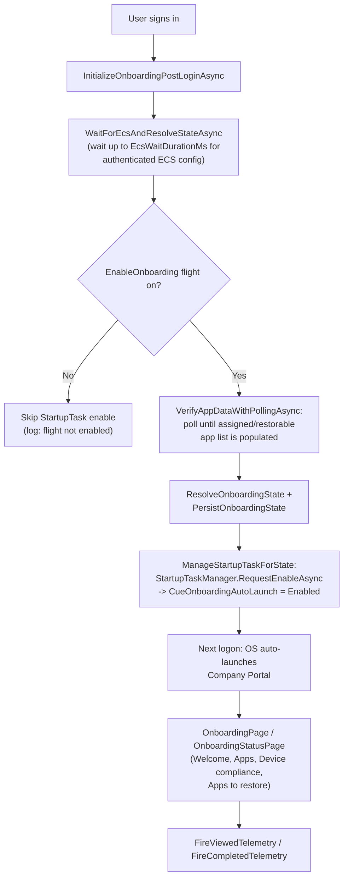
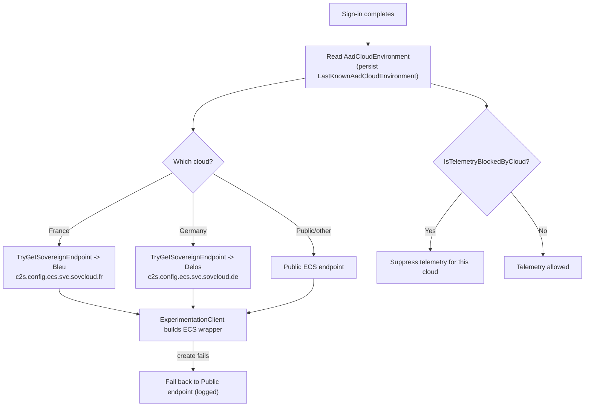
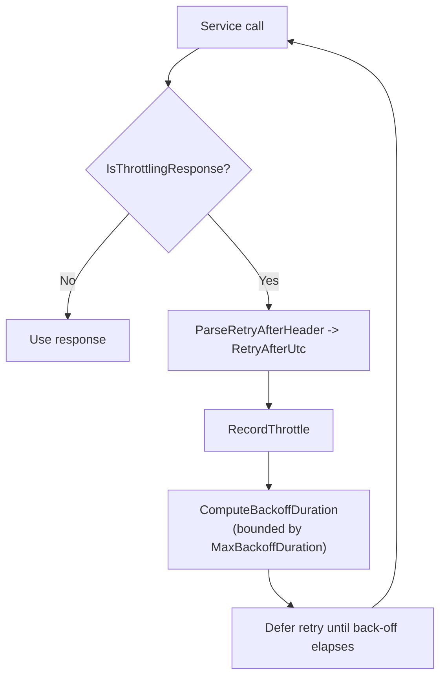

# companyportal-11.2.1899.0-to-11.2.1926.0

## Scope

This document describes the changes found between these Company Portal (`Microsoft.CompanyPortal`) packages:

| Package          | Version        |
| ---------------- | -------------- |
| Previous package | `11.2.1899.0`  |
| New package      | `11.2.1926.0`  |

Evidence sources: `.appxbundle` unpacking and `AppxBundleManifest.xml` comparison, extraction of the **x64** application `.appx` payload (canonical architecture), per-file SHA-256 inventory across the payload, `AppxManifest.xml` diffing, PE `TimeDateStamp` reads, compiled-XAML type-index (`*.xr.xml`) diffing, and ASCII **plus UTF-16LE** string extraction from `CompanyPortal.dll` with whole-identifier tokenisation.

Two method-shaping caveats carry over from the series:

1. **`CompanyPortal.dll` is a .NET Native (AOT) image.** No ECMA-335 table row counts; no readable IL. Type/method/resource-key names survive as strings, so string diffing is the primary signal and logic-level claims are avoided.
2. **The .NET Native string blob is repacked every build.** A raw string diff over-reports massively (thousands of `AwaitUnsafeOnCompletedXX`, `RegisterTypeXX`, `TypeNNNN` and adjacency-fused literals). **Every capability claim below was validated by whole-token presence counts across all four versions (`1787 / 1899 / 1926 / 1952`)** so that only true absent→present transitions are reported as "new."

This is an independent reverse-engineering report. Presence of code does not mean a feature is active for any tenant; Company Portal gates most surfaces behind ECS flights.

## Executive summary

`11.2.1926.0` is the **feature release** of this series. `CompanyPortal.dll` grew by **+761,344 bytes** and `resources.pri` by +4,976 bytes, and — unlike the surrounding rebuilds — the manifest gains a new extension and the compiled-XAML indexes grow.

Read carefully, the genuinely new surface is narrower than the raw diff suggests, and it is three things:

1. **"Cue" onboarding auto-launch.** A new UWP `windows.startupTask` (`CueOnboardingAutoLaunch`, shipped **disabled by default**) plus a client-side `StartupTaskManager`, and an **ECS-gated post-login onboarding state machine** (`WaitForEcsAndResolveStateAsync` → `ResolveOnboardingState` → `PersistOnboardingState` → `ManageStartupTaskForState`) that decides whether Company Portal should auto-open at logon to walk a newly-enrolled user through setup. The onboarding *pages* already existed; what is new is the auto-launch wiring, the state resolution, and an initial app-data verification step (`IsInitialAppDataVerified` / `VerifyAppDataWithPollingAsync`).
2. **Sovereign-cloud support** in the Experimentation/ECS client and in telemetry. New endpoint selection for France ("**Bleu**", `c2s.config.ecs.svc.sovcloud.fr`) and Germany ("**Delos**", `c2s.config.ecs.svc.sovcloud.de`) via `TryGetSovereignEndpoint`, driven by the resolved `AadCloudEnvironment` (usage grew 4→13 tokens), plus sovereign AAD change-password/profile URLs, and **telemetry cloud-gating** (`IsTelemetryBlockedByCloud` / `TelemetryIsDisabledByCloud` / `NoPrivacyPolicy`).
3. **HTTP throttle / back-off.** A new `ThrottleBackoffManager` with `ParseRetryAfterHeader` — client-side handling of HTTP 429 `Retry-After` with computed back-off.

Everything else that a naive diff flags as "new" — the Win11 redesign controls/pages, OS-recovery USB media creation, intelligent search, the featured-apps hub, restorable apps — was **already present in `11.2.1787.0`**, shipped dark behind ECS flights (`EnableWin11Redesign`, `EnableOSRecovery`, …). The bulk of the +761 KB is .NET Native recompilation of that pre-existing (still flight-gated) code, not new features. That itself is a useful finding: this binary carries a lot of unreleased UI.

## Package-level changes

| Property             | 11.2.1899.0                          | 11.2.1926.0                          |
| -------------------- | ------------------------------------ | ------------------------------------ |
| Bundle version       | `11.2.1899.0`                        | `11.2.1926.0`                        |
| PE build timestamp   | 2026-07-04 10:00:57 UTC              | 2026-07-23 10:12:27 UTC              |
| `.appxbundle` size   | 76,791,405 bytes                     | 77,908,024 bytes                     |
| x64 `.appx` size     | 19,486,853 bytes                     | 19,776,385 bytes (+289,532)          |
| `CompanyPortal.dll`  | 38,488,576 bytes                     | 39,249,920 bytes (**+761,344**)      |
| `resources.pri`      | 963,832 bytes                        | 968,808 bytes (+4,976)               |
| `AppxManifest.xml`   | 22,773 bytes                         | 23,070 bytes (+297)                  |
| `Core/Core.xr.xml`   | 78,982 bytes                         | 79,445 bytes (+463)                  |
| `Navigation/Navigation.xr.xml` | 9,636 bytes                | 11,276 bytes (+1,640)                |
| Payload file count   | 271                                  | 271 (+0 / −0)                        |
| Min OS / MaxTested   | 10.0.18362.0 / 10.0.19041.0          | same                                 |

## Changed files worth noting (x64 payload)

No files added or removed. Beyond `CompanyPortal.dll` and the resource/manifest index, the shared Self-Service-Portal assemblies that live in every bridge folder changed **content** (not just signature), consistent with the sovereign/AAD work:

| File (present in each `*Bridge*` / launcher folder)                         | 11.2.1899.0 | 11.2.1926.0 | Delta   |
| --------------------------------------------------------------------------- | ----------- | ----------- | ------- |
| `Microsoft.Management.Services.SelfServicePortal.Common.Portable.dll`       | 631,360     | 640,336     | +8,976  |
| `Microsoft.Management.Services.SelfServicePortal.Extensions.AzureAD.Common.dll` | 86,608  | 86,352      | −256    |
| `Microsoft.Management.Services.SelfServicePortal.Plugins.dll`               | 32,824      | 32,080      | −744    |

The remaining bridge binaries (`AppServices.*`, `ClientLog.dll`, `Common.Enums.dll`, `FileSystem.Desktop.dll`, `WindowsReflection.dll`, `Settings.dll`, the four `*.exe` hosts, `RecoveryMediaCreationCore.dll`) changed hash at a **0-byte** delta — rebuild/re-sign only.

## 1. The Cue onboarding auto-launch

### The manifest extension

The single manifest addition is a startup task, disabled out of the box:

```xml
<desktop:Extension Category="windows.startupTask" EntryPoint="Windows.FullTrustApplication">
  <desktop:StartupTask TaskId="CueOnboardingAutoLaunch" Enabled="false"
                       DisplayName="ms-resource://Microsoft.CompanyPortal/AppConstants/ApplicationName" />
</desktop:Extension>
```

`Enabled="false"` means the OS will not auto-start Company Portal until the app itself flips the task to enabled through the UWP `StartupTask` API — which is exactly what the new client code does, and only when an ECS flight says so.

### The state machine (all names are verbatim tokens, new in 1926)

`CompanyPortal.dll` gains the StartupTask plumbing and an onboarding resolver:

- **StartupTask API wrapper:** `IStartupTask`, `IStartupTaskManager`, `IStartupTaskStatics`, `StartupTaskManager`, `StartupTaskState`, `StartupTaskStateChanged`, `StartupTaskEnabled`, `StartupTaskContract`, `ManageStartupTaskAsync`, `RequestEnableAsync`, `IsAutoLaunch`, `IsAutoLaunchAsync`.
- **Onboarding resolver:** `InitializeOnboardingPostLoginAsync`, `WaitForEcsAndResolveStateAsync`, `ResolveOnboardingState`, `ResolvedOnboardingState`, `PersistOnboardingState`, `LoadPersistedOnboardingState`, `ManageStartupTaskForState`, `IsOnboardingEnabled`, `OnboardingState`, `OnboardingStateChanged`(+`EventArgs`), `RefreshLocalDeviceForOnboardingAsync`, `HandleDoneCommand`, `NavigateToOnboardingPage`, `NavigateToOnboardingStatusPage`.
- **Initial app-data gate:** `IsInitialAppDataVerified`, `VerifyAppDataWithPollingAsync` (poll the service until the assigned-app list is populated before declaring onboarding "ready"), tied to the existing `RestorableApps` list (`LoadRestorableAppsListAsync`, `IsRestorableAppsSectionApplicable`).
- **Telemetry:** `OnboardingEcsWaitCompleted`, `OnboardingStatusPageViewed`, `OnboardingStatusPageCompleted`, `FireViewedTelemetry`, `FireCompletedTelemetry`.

The behaviour is spelled out by the log literals:

```
[ECS_Onboarding] WaitForEcsAndResolveStateAsync: waiting up to {0}s for authenticated ECS config...
[ECS_Onboarding] WaitForEcsAndResolveStateAsync: ECS config {0} after {1}ms. EnableOnboarding={2}, ResolvedState={3}
[StartupTask] EnableOnboarding flight is not enabled. Skipping StartupTask enable.
```

So after login the client waits (bounded by `EcsWaitDurationMs`) for an **authenticated** ECS config, reads the `EnableOnboarding` flight, resolves an onboarding state, persists it, and only then asks the OS to enable the `CueOnboardingAutoLaunch` startup task so the next logon re-opens Company Portal into the onboarding experience. The onboarding UI strings themselves (`Onboarding_WelcomeOrganizationName_Header`, `Onboarding_OverviewHeaderText`, `Onboarding_ApplicationsHeaderText`, `Onboarding_DeviceComplianceHeaderText`, `Onboarding_DeviceCompliance_CompliantDescription` / `_ActionRequired`, `Onboarding_PopUp_TakeActionHeaderText`, `Onboarding_StatusPage_AppsToRestore`, `Onboarding_StatusPage_NonCompliantInGracePeriod`, `Onboarding_ContinueButton`) are **unchanged** from `11.2.1787.0` — confirming the pages pre-existed and 1926 adds the driver, not the screens.



## 2. Sovereign-cloud support (Experimentation/ECS + telemetry)

The Experimentation client learns to pick its ECS configuration endpoint from the signed-in **AAD cloud environment** rather than always using the public endpoint. New tokens (all absent in `1787`/`1899`, present in `1926`):

- `TryGetSovereignEndpoint`, `FrenchSovereign`, `GermanySovereign`, `BleuEndpoint`, `DelosEndpoint`, `CloudInstanceNameFranceCloud`, `CloudInstanceNameGermanyCloud`, `LastKnownAadCloudEnvironment`, and `AadCloudEnvironment` usage rising from 4→13.
- Sovereign AAD URLs: `AadChangePasswordFrance`, `AadChangePasswordGermany`, `AadProfileFrance`, `AadProfileGermany`.
- The two sovereign ECS endpoints appear verbatim:

```
https://c2s.config.ecs.svc.sovcloud.fr   (Bleu   – France / "S3NS" sovereign)
https://c2s.config.ecs.svc.sovcloud.de   (Delos  – Germany sovereign)
```

Supporting log literals:

```
ECS endpoint switched for cloud {0} to {1}
ExperimentationClient: failed to create ECS wrapper for {0}, falling back to Public endpoint. {1}: {2}
Client telemetry: AadCloudEnvironment changed to {0}.
```

**Telemetry is now gated by cloud** as a companion change: `IsTelemetryBlockedByCloud`, `IsTelemetryAllowedForCloud`, `TelemetryIsDisabledByCloud`, the `Telemetry_DisabledForCloud` resource string, `DisableStoreTelemetry`, plus a "no privacy policy configured" path (`NotifyNoPrivacyPolicyAsync`, `NoPrivacyPolicy_HeaderText`/`_ContentText`) and admin/custom privacy messaging (`CustomCanSeePrivacyMessage` / `CustomCantSeePrivacyMessage`). The +8,976 B growth of `SelfServicePortal.Common.Portable.dll` and the churn in `…Extensions.AzureAD.Common.dll` are consistent with this sovereign-AAD/endpoint work.



## 3. HTTP throttle / back-off

New client-side resilience for throttled service responses. New tokens: `ThrottleBackoffManager`, `IThrottleBackoffManager`, `IThrottleBackoffPolicy`, `DefaultThrottleBackoffPolicy`, `ThrottleBackoffException`, `ComputeBackoffDuration`, `MaxBackoffDuration`, `RecordThrottle`, `IsThrottlingResponse`, `IsThrottlingException`, `RetryAfterUtc`, `ParseRetryAfterHeader`, `BackOffHttpRequest`.

Read together: when a request comes back throttled (HTTP 429 / throttling response), the client parses the `Retry-After` header, records the throttle, computes a bounded back-off (`MaxBackoffDuration`) and defers the retry — replacing naive immediate retries against `manage.microsoft.com`-class endpoints.



## 4. What did NOT change (despite the +761 KB and the noisy diff)

These features show large token counts that are **identical across `1787 / 1899 / 1926 / 1952`**, i.e. they were already fully present before this release and are gated by flights, not introduced here:

- **Win11 redesign** — `RedesignControls` (205 tokens in every build), `RedesignPages`, `FluentAppShellRedesign`, gated by `EnableWin11Redesign`.
- **OS-recovery USB media creation** — `OSRecoveryProfiles` (37 in every build), `CreateOSRecoveryUsbDrivePage`, `OsRecoveryMediaCreationAppService`, the `RecoveryMediaCreationTool` full-trust sidecar and its `CreateOsRecoveryMediaCreationConnection` factory — gated by `EnableOSRecovery`.
- **Intelligent search** — `IntelligentSearch.SearchResults` (10 in every build), `NavigationMenuSearchControl`, `RawAppSearchResult`/`RawDeviceSearchResult`/`RawUriSearchResult`.
- **Featured-apps hub** — `FeaturedHub` (17 in every build), `IsFeaturedHubOnHomePage`, `FeaturedHubMessageBox`.
- **Restorable apps / BitLocker recovery keys** — `RestorableApps` and `GetBitLockerRecoveryKeysUri` / `RotateUserSubmittedPersonalRecoveryKeyUri` counts flat.

The `Core.xr.xml` (+463 B) and `Navigation.xr.xml` (+1,640 B) growth registers additional XAML types into the Core/Navigation resource groups, but the underlying type names already existed in the binary — this is XAML-index reorganisation accompanying the onboarding wiring, not a fresh page set.

## Evidence and confidence

### High confidence (verified by absent→present token counts across all four builds)

- `CueOnboardingAutoLaunch` startup task (manifest) + `StartupTaskManager` / `ManageStartupTaskForState` / `IsAutoLaunch` (0→present).
- ECS-gated onboarding resolver: `WaitForEcsAndResolveStateAsync`, `IsInitialAppDataVerified`, `VerifyAppDataWithPollingAsync` (0→present), with the three `[ECS_Onboarding]` / `[StartupTask]` log literals verbatim.
- Sovereign-cloud endpoint selection: `BleuEndpoint`, `DelosEndpoint`, `FrenchSovereign`, `GermanySovereign`, `TryGetSovereignEndpoint`, `AadChangePasswordFrance/Germany` (0→present), plus the two `sovcloud` ECS URLs.
- Telemetry cloud-gating: `IsTelemetryBlockedByCloud`, `TelemetryIsDisabledByCloud` (0→present).
- HTTP throttle/back-off: `ThrottleBackoffManager`, `ParseRetryAfterHeader` (0→present).
- Non-changes: redesign / OS-recovery / search / featured-hub / restorable-apps / BitLocker token counts flat across all four builds.

### Inferred, not confirmed

- The exact ordering and retry semantics of the onboarding jobs and the back-off curve (`ComputeBackoffDuration`) — names and log strings are confirmed; the timing/curve is not readable without IL.
- Attribution of the `SelfServicePortal.Common.Portable.dll` (+8,976 B) / `…AzureAD.Common.dll` growth to the sovereign-AAD work — consistent, but these managed assemblies were not decompiled.
- That the bulk of the `CompanyPortal.dll` +761 KB is recompilation of pre-existing flight-gated code (strongly implied by flat feature-token counts, not separately measured byte-for-byte).

### Flight or server dependent

- `EnableOnboarding` (drives `CueOnboardingAutoLaunch`), the sovereign endpoint selection (driven by `AadCloudEnvironment`), `IsTelemetryBlockedByCloud`, and the pre-existing `EnableWin11Redesign` / `EnableOSRecovery` flags. None of these values ship in the package; they arrive from ECS at runtime.

## Suggested validation

**Cue onboarding:** on a freshly-enrolled device with the `EnableOnboarding` flight on, sign in and watch for a Start-menu startup entry for Company Portal (`Get-StartApps`, or Settings ▸ Apps ▸ Startup) appearing after first login; confirm the next logon auto-opens Company Portal into the onboarding/status page. With the flight off, confirm the startup task stays disabled and the `[StartupTask] … Skipping StartupTask enable` line appears in the client log.

**Sovereign cloud:** on a France/Germany sovereign tenant, capture Company Portal traffic and confirm ECS config is fetched from `c2s.config.ecs.svc.sovcloud.fr` / `.de` (not the public endpoint), and confirm telemetry is suppressed where `IsTelemetryBlockedByCloud` applies.

**Throttle/back-off:** induce or simulate HTTP 429 with a `Retry-After` from a Company Portal service call and confirm the client defers the retry to the header's time rather than retrying immediately.

## Final assessment

`11.2.1926.0` is the substantive release between two rebuilds. Its net-new, verifiable surface is compact and coherent: an **ECS-gated, auto-launch onboarding experience** ("Cue") wired through the UWP StartupTask API, **sovereign-cloud awareness** in the Experimentation/telemetry stack (France "Bleu", Germany "Delos"), and **HTTP throttle/back-off** resilience. The much larger binary growth is dominated by recompilation of already-shipped, still-flight-gated code — the Win11 redesign, OS-recovery USB media creation, intelligent search and the featured-apps hub were all present as far back as `11.2.1787.0`. For a change tracker, the headline is onboarding auto-launch and sovereign clouds; the sleeper story is how much finished-but-dark UI Company Portal is already carrying.

## Sources

- Microsoft Intune Company Portal app (`Microsoft.CompanyPortal`)
- UWP `StartupTask` / `windows.startupTask` app extension — Microsoft Docs
- Experimentation & Configuration Service (ECS) client model; AAD sovereign cloud instances (France "Bleu"/S3NS, Germany "Delos")
- HTTP `Retry-After` (RFC 9110) throttling semantics
- .NET Native (UWP AOT) compilation model — Microsoft Docs
