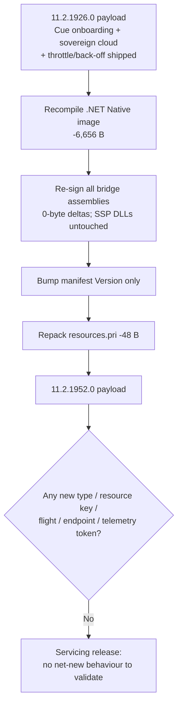

# companyportal-11.2.1926.0-to-11.2.1952.0

## Scope

This document describes the changes found between these Company Portal (`Microsoft.CompanyPortal`) packages:

| Package          | Version        |
| ---------------- | -------------- |
| Previous package | `11.2.1926.0`  |
| New package      | `11.2.1952.0`  |

Evidence sources: `.appxbundle` unpacking and `AppxBundleManifest.xml` comparison, extraction of the **x64** application `.appx` payload (canonical architecture), per-file SHA-256 inventory, `AppxManifest.xml` diffing, PE `TimeDateStamp` reads, compiled-XAML type-index (`*.xr.xml`) diffing, and ASCII **plus UTF-16LE** string extraction from `CompanyPortal.dll` with whole-identifier tokenisation.

The same two method-shaping caveats apply as in the rest of this series:

1. **`CompanyPortal.dll` is a .NET Native (AOT) image** — no ECMA-335 tables, no readable IL; type/method/resource-key names survive as strings.
2. **The .NET Native string blob repacks every build**, so a raw string diff over-reports heavily. **Every claim here is validated by whole-token presence counts across all four versions (`1787 / 1899 / 1926 / 1952`)**, reporting only true absent→present transitions.

This is an independent reverse-engineering report. Presence of code does not mean a feature is active for any tenant.

## Executive summary

`11.2.1952.0` is a **servicing / rebuild release on top of `11.2.1926.0`, with no observable net-new functionality.** `CompanyPortal.dll` actually **shrank by 6,656 bytes**, `resources.pri` by 48 bytes, and the manifest is byte-for-byte identical except the version stamp.

- No files added or removed (271 → 271).
- `AppxManifest.xml` differs only in the `Version` attribute; the `CueOnboardingAutoLaunch` startup task, the `companyportal:` protocol, app-service and full-trust registrations are all identical to `11.2.1926.0`.
- Whole-token analysis finds **no absent→present feature transition** between `1926` and `1952`. The tokens the raw diff surfaces (`get_EnableWin11Redesign`, `get_EnableOSRecovery`, `ParseHttpResponse…`, hundreds of `TypeNNNN` / `AwaitUnsafeOnCompletedXX`) are all repack/adjacency artifacts of the same pre-existing strings, not new code — each is present in equal count in `1926`.
- All bridge assemblies changed hash at a **0-byte** size delta (rebuild + re-sign).

In short: `1926` shipped the features (Cue onboarding auto-launch, sovereign-cloud ECS/telemetry, HTTP throttle/back-off); `1952` is a follow-up build that recompiles and re-signs that same payload, plus whatever small internal fixes are hidden in the −6,656 B of `CompanyPortal.dll` that leave no new readable strings.

## Package-level changes

| Property             | 11.2.1926.0                          | 11.2.1952.0                          |
| -------------------- | ------------------------------------ | ------------------------------------ |
| Bundle version       | `11.2.1926.0`                        | `11.2.1952.0`                        |
| PE build timestamp   | 2026-07-23 10:12:27 UTC              | 2026-08-04 10:52:47 UTC              |
| `.appxbundle` size   | 77,908,024 bytes                     | 77,903,506 bytes                     |
| x64 `.appx` size     | 19,776,385 bytes                     | 19,773,299 bytes (−3,086)            |
| `CompanyPortal.dll`  | 39,249,920 bytes                     | 39,243,264 bytes (**−6,656**)        |
| `resources.pri`      | 968,808 bytes                        | 968,760 bytes (−48)                  |
| `AppxManifest.xml`   | 23,070 bytes                         | 23,070 bytes (0)                     |
| Payload file count   | 271                                  | 271 (+0 / −0)                        |
| Min OS / MaxTested   | 10.0.18362.0 / 10.0.19041.0          | same                                 |

## Changed files (x64 payload)

58 files changed content hash; only `CompanyPortal.dll` (−6,656 B), `resources.pri` (−48 B) and the signature/blockmap/catalog files carry a real delta. The shared Self-Service-Portal assemblies (`…Common.Portable.dll`, `…Extensions.AzureAD.Common.dll`, `…Plugins.dll`) are **unchanged** from `11.2.1926.0` (they did *not* appear in this transition's diff), confirming the sovereign/AAD work landed in `1926` and is untouched here. Every other bridge binary changed hash at a 0-byte delta (rebuild/re-sign). No `*.xr.xml` changed — no XAML type registration moved.

## 1. Why this is a no-op

The manifest diff is version-only:

```
- <Identity Name="Microsoft.CompanyPortal" … Version="11.2.1926.0" ProcessorArchitecture="x64" />
+ <Identity Name="Microsoft.CompanyPortal" … Version="11.2.1952.0" ProcessorArchitecture="x64" />
```

The `windows.startupTask` extension added in `1926` is still present and still `Enabled="false"`; nothing else in the manifest moves.

The three features introduced in `1926` are present and unchanged here, at identical token counts: `CueOnboardingAutoLaunch` (7), `StartupTaskManager` (3), `WaitForEcsAndResolveStateAsync` (6), `BleuEndpoint`/`DelosEndpoint`/`FrenchSovereign`/`GermanySovereign`/`TryGetSovereignEndpoint` (1 each), `IsTelemetryBlockedByCloud` (3), `ThrottleBackoffManager` (4), `ParseRetryAfterHeader` (1). The still-flight-gated features (`RedesignControls` 211, `OSRecoveryProfiles` 37, `IntelligentSearch` 10, `FeaturedHub` 17, `RestorableApps` 87) are likewise flat.

No token crosses absent→present between `1926` and `1952`. The `CompanyPortal.dll` shrinking by 6,656 bytes with no new readable strings is consistent with a routine recompile and minor internal fixes (dead-code trimming, a bug fix in existing logic) that do not introduce new type, resource, endpoint, flight or telemetry names.



## Evidence and confidence

### High confidence (directly observed / verified by token counts)

- No files added or removed; 271 → 271.
- Manifest differs only by `Version`; the `CueOnboardingAutoLaunch` startup task is unchanged and still disabled by default.
- `CompanyPortal.dll` −6,656 B, `resources.pri` −48 B; no `*.xr.xml` changed.
- The Self-Service-Portal shared assemblies are unchanged from `1926`.
- No absent→present feature-token transition between `1926` and `1952`; the `1926` feature tokens and the pre-existing flight-gated feature tokens are all flat.

### Inferred, not confirmed

- The −6,656 B of `CompanyPortal.dll` is attributed to recompilation plus minor fixes in existing code paths. Without readable IL this cannot be characterised further; no new readable strings accompany it, so no new capability is claimed.

### Flight or server dependent

- Unchanged from `1926`: `EnableOnboarding`, sovereign endpoint selection (`AadCloudEnvironment`), `IsTelemetryBlockedByCloud`, and the pre-existing `EnableWin11Redesign` / `EnableOSRecovery` flags. Any behaviour difference a user sees between these two builds would come from an ECS flight flip, not from the package.

## Suggested validation

There is no net-new behaviour to validate. To confirm the servicing conclusion: update to `11.2.1952.0`, verify the version bump, and confirm the onboarding startup task, sovereign endpoint selection, and throttle/back-off behaviour are identical to `11.2.1926.0`. If a regression is suspected, compare client logs around the `[ECS_Onboarding]` / `[StartupTask]` lines and any throttle back-off entries against a `1926` baseline, since those code paths are the most recently changed in the series.

## Final assessment

`11.2.1952.0` is a maintenance build of `11.2.1926.0`. It re-stamps the version, re-signs the payload, slightly shrinks the main image, and introduces no new type, page, flight, endpoint or telemetry surface. All of the interesting behaviour in this window — Cue onboarding auto-launch, sovereign-cloud ECS/telemetry, HTTP throttle/back-off — belongs to `11.2.1926.0` and is carried forward unchanged. Record this as a servicing checkpoint.

## Sources

- Microsoft Intune Company Portal app (`Microsoft.CompanyPortal`)
- MS-APPX / AppxBundle packaging format
- .NET Native (UWP AOT) compilation model — Microsoft Docs
