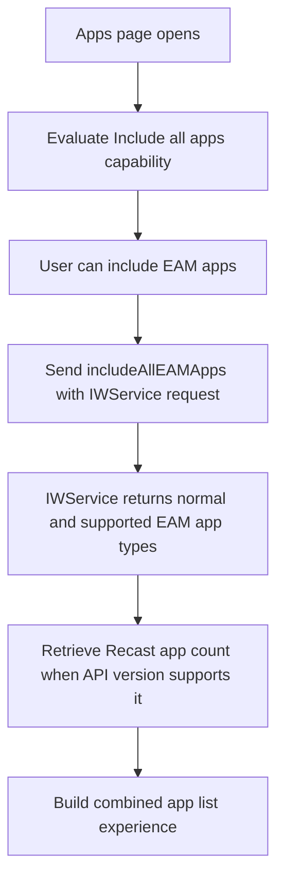
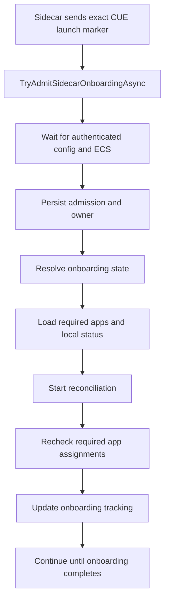
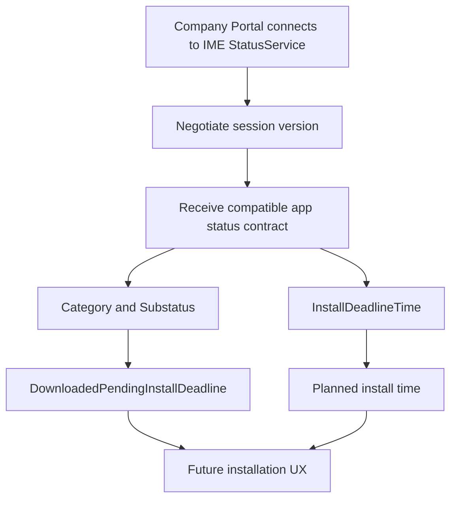

# company-portal-11.2.2021.0-to-11.2.2035.0

## Scope

This report compares Company Portal `11.2.2021.0` with `11.2.2035.0` using the original APPXBUNDLE packages and the extracted x64 APPX payloads.

The comparison includes package inventory, APPX manifest changes, SHA 256 comparison, `CompanyPortal.dll`, compiled XAML runtime metadata, `resources.pri`, printable strings, and managed bridge/service assemblies. `CompanyPortal.dll` is .NET Native, so structural evidence and shipped strings are used rather than claiming normal managed IL control flow.

Presence of a code path does not prove that it is enabled for every tenant because Company Portal uses service configuration, feature flighting, and negotiated service contracts.

## Executive summary

`11.2.2035.0` is a major Company Portal update. The installation deadline feature is only one part of the change.

The package introduces an EAM/Recast aware All Apps pipeline, a much stricter CUE Sidecar admission and reconciliation model, a newer IME StatusService contract with richer app states and installation deadline data, and Configuration Manager security hardening around HTTPS fallback and certificate validation.

The release also changes search and accessibility metadata and lowers the package minimum Windows version from `10.0.18362.0` to `10.0.17763.0`.

The clearest way to describe `2035` is that several existing Company Portal workloads become more state aware, more explicit about local service contracts, and more defensive about how they interact with Sidecar and Configuration Manager.

## Package level changes

| Property | 11.2.2021.0 | 11.2.2035.0 |
| --- | ---: | ---: |
| APPXBUNDLE size | `77,903,082` | `78,976,286` |
| x64 APPX size | `19,773,496` | `20,060,885` |
| x64 extracted size | `53,810,574` | `54,562,921` |
| x64 file count | `271` | `271` |
| Added files | `0` | `0` |
| Removed files | `0` | `0` |
| Files with changed SHA 256 |  | `80` |
| `CompanyPortal.dll` | `39,243,776` | `39,955,968` |
| `resources.pri` | `968,688` | `970,648` |
| `Core/Core.xr.xml` | `79,445` | `79,565` |
| `Navigation/Navigation.xr.xml` | `11,276` | `12,030` |
| Windows minimum version | `10.0.18362.0` | `10.0.17763.0` |

APPXBUNDLE SHA 256:

`11.2.2021.0`: `876c09142edccc9fafe0d8894995a20824f6b3cb9c55944233ea215544320a36`

`11.2.2035.0`: `b7a7930a8380ded8f24e023af1a320b131396a34efc26d0400d38a78227b83a2`

`CompanyPortal.dll` SHA 256:

`11.2.2021.0`: `0d335d63a2d1f2d930740a3ab15d8f4cbe534ddb3b479660cb575803d3a8fab6`

`11.2.2035.0`: `4b2b52ae0a4904e595c7867f4938011ea69402a0951b516f12bd94da773df2ad`

## What changed in this release

| Area | 2021 | 2035 |
| --- | --- | --- |
| All Apps | Existing app list | Adds EAM/Recast aware `Include all apps` path |
| CUE | Existing startup and onboarding state model | Adds explicit Sidecar admission, persistence, resume, revalidation, and reconcile loop |
| IME app status | Older StatusService contract | Adds Status3, category/substatus, negotiated session version, and install deadline |
| Configuration Manager | Existing bridge path | Adds HTTPS downgrade protection and certificate validation hardening |
| Search/accessibility | Existing runtime metadata | Adds new search and accessibility metadata/resources |
| Windows minimum | `18362` | `17763` |

## 1. EAM/Recast becomes part of the All Apps pipeline

This is a distinct feature line and not part of the deadline work.

New Company Portal names include:

```text
IncludeAllEAMApps
IncludeAllEamApps
ShowIncludeEAMAppsToggle
ShowIncludeAllAppsToggle
AppListIncludeAllEamAppsToggled
EamStatic
EamAutoUpdate
EamRecast
RecastAppsCount
GetRecastApplicationsCountAsync
GetOrFetchRecastAppsCountAsync
```

The service layer adds:

```text
IncludeAllEAMAppsQueryParameter
includeAllEAMApps
GetApplicationsCountAsync
EamStatic
EamAutoUpdate
EamRecast
```

The resource package adds:

```text
AppListing_IncludeAllApps
AppsListPage_IncludeAllAppsToggle
Include all apps
```

The diagnostic strings also show that the Recast app count is tied to the negotiated IWService API:

```text
The Recast app count is unavailable because the negotiated IW Service API does not support it.
Retrieved {0} Recast applications from the IWS count request.
```

### App list flow



The internal `Recast` naming is directly present in the binaries. This report does not infer a public product name beyond the explicit shipped strings.

## 2. CUE gains a stricter Sidecar admission model

The original CUE startup task and onboarding architecture already existed. `2035` adds another layer around how a Sidecar initiated CUE session is admitted, persisted, resumed, and validated.

New names include:

```text
SidecarOnboardingAdmitted
SidecarOnboardingAdmissionOwnerV1
TryAdmitSidecarOnboardingAsync
TryResumePersistedSidecarOnboardingAsync
RefreshDeviceAndValidatePersistedSidecarOnboardingAsync
RevalidateSidecarOnboardingAdmissionWithEcsAsync
WaitForAuthenticatedConfigAsync
ShouldKeepCurrentPageForCueLaunch
OnboardingReconcileOutcome
```

One of the clearest new strings is:

```text
Ignoring serialized CUE onboarding arguments because only the exact Sidecar marker can start onboarding.
```

That is important because it shows that Company Portal is no longer simply accepting any serialized onboarding launch state. The Sidecar initiated path now has an explicit marker and an admission decision.

The package also gains `[Onboarding][Reconcile]` messages describing a background recheck of required apps. Company Portal can requery the required app list, remove apps that IWService no longer reports as required, avoid removing apps whose state changed while the query was running, and retry cleanup of temporary tracking.

### CUE flow in 2035



This is a substantial evolution of the earlier `1926` CUE state model rather than a new startup task.

## 3. IME StatusService gains richer app status and installation deadline data

The bundled IME status contract moves from the old `1.52.202.0` generation to `1.106.52.0`.

| Property | 2021 | 2035 |
| --- | ---: | ---: |
| Status library size | `24,984` | `28,536` |
| Target framework | `.NET Framework 4.6` | `.NET Framework 4.7.2` |

New contract members include:

```text
AppInstallStatus3
AppInstallStatusCategory
AppInstallSubstatus
VersionInfoAttribute
NegotiateSessionVersionAsync
Status3
Category
Substatus
InstallDeadlineTime
DownloadedPendingInstallDeadline
WinGetPackageNotFound
WinGetProcessTimeout
```

`IntuneManagementExtensionBridge.exe` gains the matching session negotiation and Status3 handling. The shared app service contract also gains `NegotiatedSessionVersion`.

Company Portal adds:

```text
IApplicationInstallDeadlineProvider
GetInstallDeadlineAsync
DownloadedPendingInstallDeadline
DownloadedPendingInstallDeadlineDetails
FutureInstallationTelemetryReported
```

The matching user facing text includes:

```text
Downloaded for future installation
Downloaded successfully, will be installed on {0:g}
{0} is downloaded for future installation
```

### Status flow



This is the source of the deadline aware user experience, but it is part of a broader StatusService contract change.

## 4. Configuration Manager communication is hardened

A separate security line appears in the Configuration Manager path.

New names include:

```text
BlockConfigurationManagerHttpsToHttpFallback
RestrictConfigurationManagerAppDescriptionLinksToWebSchemes
DisableCcmCertificateIdentityValidation
CcmIssuingSslValidator
ConfigurationManagerCredentialWithheldOverInsecureChannel
ConfigurationManagerFallbackRegistrationBlocked
```

The new diagnostics describe concrete protections:

```text
Fallback URL uses a less secure scheme than the primary HTTPS endpoint. Fallback registration skipped to prevent credential exposure over an unencrypted channel.
Attempt to validate custom chain against SCCM issuing certificates
SSL certificate name does not match any expected host
SSL certificate validation failed. The certificate does not chain to any of the specified SCCM issuing certificates.
```

The package therefore contains explicit logic for HTTPS downgrade prevention, certificate hostname validation, and trust validation against configured SCCM issuing certificates.

These paths are flight aware. Their presence proves the client capability exists, not that every tenant or device has every check enabled.

## 5. Search and accessibility metadata changes

The compiled XAML grows in `2035` and adds runtime metadata including:

```text
Control.Padding
StateTrigger.IsActive
AutomationProperties.AccessibilityView
RelativePanel.AlignVerticalCenterWithPanel
FontIcon
ToggleSwitch.Visibility
```

New resources include:

```text
SearchBoxDisabled
SearchBoxEnabled
SearchBoxEnabledStates
SearchGlyph
SearchGlyph.Foreground
CompanyPortalTableSeparatorBrush
CompanyTerms_PrivacyPolicyNarratorWithFormat
{0}, opens in a new tab
```

These changes indicate search and accessibility work, but they are smaller than the EAM, CUE, IME status, and Configuration Manager changes.

## 6. The Windows compatibility floor is lowered

The manifest changes from:

```text
MinVersion="10.0.18362.0"
```

to:

```text
MinVersion="10.0.17763.0"
```

`MaxVersionTested` remains `10.0.19041.0`.

This is a packaging compatibility change. It does not prove every feature behaves identically on every supported Windows build.

## 7. What stays unchanged

The existing `CueOnboardingAutoLaunch` startup task remains. The four existing bridge app services remain. The unified Devices page loading path remains. No new package file is added and no existing package file is removed.

So the major change is inside the behavior of existing Company Portal workloads rather than a new top level package architecture.

## 8. Bridge components

The bridge binaries are rebuilt as part of the release, but no functional BridgeLauncher code change was identified. Detailed BridgeLauncher hashes, framework metadata, and signing observations are kept in the separate `BridgeLauncher-history-11.2.1952.0-to-11.2.2044.0.MD` report.

## Bottom line

`11.2.2035.0` is much bigger than the installation deadline feature. It introduces EAM/Recast handling in the All Apps pipeline, a stricter and more resilient Sidecar CUE admission model, a richer IME app status contract, and Configuration Manager transport and certificate hardening. Search/accessibility metadata and the Windows compatibility floor also change in the same build.
