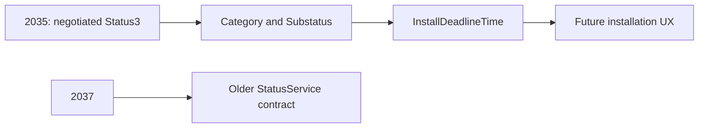

# company-portal-11.2.2035.0-to-11.2.2037.0

## Scope

This report compares Company Portal `11.2.2035.0` with `11.2.2037.0` using the original APPXBUNDLE packages and the extracted x64 APPX payloads.

The comparison includes package inventory, APPX manifest changes, SHA 256 comparison, `CompanyPortal.dll`, compiled XAML runtime metadata, `resources.pri`, printable strings, and managed bridge/service assemblies. `CompanyPortal.dll` is .NET Native, so structural evidence and shipped strings are used rather than claiming normal managed IL control flow.

Presence of a code path does not prove that it is enabled for every tenant because Company Portal uses service configuration, feature flighting, and negotiated service contracts.

## Executive summary

`11.2.2037.0` is a partial rollback of the much larger `2035` feature build.

The richer IME StatusService contract and deadline aware app status disappear. The newer Sidecar CUE admission and reconciliation layer also disappears. The Configuration Manager HTTPS and certificate hardening introduced in `2035` is removed as well. Search and accessibility metadata shrinks and the Windows minimum version returns to `10.0.18362.0`.

The rollback is not complete. The EAM/Recast All Apps feature remains in place and its shared service library is byte identical between `2035` and `2037`.

That makes `2037` useful because it shows which `2035` changes belonged to independent feature lines rather than one single release switch.

## Package level changes

| Property | 11.2.2035.0 | 11.2.2037.0 |
| --- | ---: | ---: |
| APPXBUNDLE size | `78,976,286` | `78,025,583` |
| x64 APPX size | `20,060,885` | `19,810,385` |
| x64 extracted size | `54,562,921` | `53,906,137` |
| x64 file count | `271` | `271` |
| Added files | `0` | `0` |
| Removed files | `0` | `0` |
| Files with changed SHA 256 |  | `64` |
| `CompanyPortal.dll` | `39,955,968` | `39,310,336` |
| `resources.pri` | `970,648` | `969,216` |
| `Core/Core.xr.xml` | `79,565` | `79,487` |
| `Navigation/Navigation.xr.xml` | `12,030` | `11,276` |
| Windows minimum version | `10.0.17763.0` | `10.0.18362.0` |

APPXBUNDLE SHA 256:

`11.2.2035.0`: `b7a7930a8380ded8f24e023af1a320b131396a34efc26d0400d38a78227b83a2`

`11.2.2037.0`: `7369c76bfdd443807e2086b6b6d050f81df344aeacbbd2487b28eb19cc361faa`

`CompanyPortal.dll` SHA 256:

`11.2.2035.0`: `4b2b52ae0a4904e595c7867f4938011ea69402a0951b516f12bd94da773df2ad`

`11.2.2037.0`: `e71294278c86630e025e96dce8a1fb0069152ca2d20f678c8ab0ff3591fb8dff`

## What changes direction in this release

| Area | 2035 | 2037 |
| --- | --- | --- |
| EAM/Recast | Present | Retained |
| Sidecar CUE admission/reconcile | Present | Removed |
| Status3 and deadline | Present | Removed |
| ConfigMgr security hardening | Present | Removed |
| Search/accessibility XAML line | Present | Rolled back |
| Windows minimum | `17763` | `18362` |

## 1. Status3 and installation deadline handling are removed

The bundled IME status library moves from `1.106.52.0` back to the older `1.52.202.0` generation:

```text
2035: 28,536 bytes, .NET Framework 4.7.2
2037: 24,984 bytes, .NET Framework 4.6
```

The following contract members disappear:

```text
AppInstallStatus3
AppInstallStatusCategory
AppInstallSubstatus
NegotiateSessionVersionAsync
InstallDeadlineTime
DownloadedPendingInstallDeadline
WinGetPackageNotFound
WinGetProcessTimeout
```

`IntuneManagementExtensionBridge.exe` also loses the matching negotiation and Status3 members. The shared app service contract loses `NegotiatedSessionVersion`.

The user facing deadline text disappears too:

```text
Downloaded for future installation
Downloaded successfully, will be installed on {0:g}
```

### Status path before and after



The important point is that `2037` does not simply hide the text. The newer local contract itself is removed from the package.

## 2. The newer Sidecar CUE admission layer is removed

The original CUE startup architecture remains. What disappears is the newer `2035` Sidecar admission and reconciliation layer.

Removed names include:

```text
SidecarOnboardingAdmitted
SidecarOnboardingAdmissionOwnerV1
TryAdmitSidecarOnboardingAsync
TryResumePersistedSidecarOnboardingAsync
RefreshDeviceAndValidatePersistedSidecarOnboardingAsync
RevalidateSidecarOnboardingAdmissionWithEcsAsync
WaitForAuthenticatedConfigAsync
ShouldKeepCurrentPageForCueLaunch
OnboardingReconcileOutcome
```

The exact Sidecar marker diagnostic also disappears, together with the `[Onboarding][Reconcile]` required app recheck loop.

So the correct interpretation is:

```text
Base CueOnboardingAutoLaunch architecture: retained
2035 Sidecar admission and reconcile enhancement: removed
```

This matters because it shows the `2035` CUE work was an enhancement around the existing onboarding state machine rather than a replacement for it.

## 3. Configuration Manager security hardening is removed

The following `2035` names disappear from `2037`:

```text
BlockConfigurationManagerHttpsToHttpFallback
RestrictConfigurationManagerAppDescriptionLinksToWebSchemes
DisableCcmCertificateIdentityValidation
CcmIssuingSslValidator
ConfigurationManagerCredentialWithheldOverInsecureChannel
ConfigurationManagerFallbackRegistrationBlocked
```

The associated diagnostics about insecure fallback URLs, hostname mismatches, and SCCM issuing certificate validation disappear as well.

That is a meaningful rollback because this was a separate security path and not part of the IME deadline work.

## 4. EAM/Recast remains

This is the clearest evidence that `2037` is not a full rollback to `2021`.

The following remain present:

```text
IncludeAllEAMApps
ShowIncludeEAMAppsToggle
EamStatic
EamAutoUpdate
EamRecast
RecastAppsCount
GetRecastApplicationsCountAsync
```

The resources remain:

```text
AppListing_IncludeAllApps
AppsListPage_IncludeAllAppsToggle
Include all apps
```

The shared `Microsoft.Management.Services.SelfServicePortal.Common.Portable.dll` is `646,008` bytes and byte identical between `2035` and `2037`. It still contains:

```text
IncludeAllEAMAppsQueryParameter
includeAllEAMApps
EamStatic
EamAutoUpdate
EamRecast
```

So the All Apps EAM/Recast feature line survives intact while several other `2035` features are removed.

## 5. Search and accessibility metadata move back

The additional `2035` search and accessibility resource line disappears, including:

```text
SearchBoxDisabled
SearchBoxEnabled
SearchBoxEnabledStates
SearchGlyph
SearchGlyph.Foreground
CompanyPortalTableSeparatorBrush
```

`Navigation/Navigation.xr.xml` returns from `12,030` to `11,276` bytes and `Core/Core.xr.xml` also shrinks.

This is consistent with the package moving back toward the older XAML feature line.

## 6. The Windows compatibility floor moves back

The manifest changes from:

```text
MinVersion="10.0.17763.0"
```

to:

```text
MinVersion="10.0.18362.0"
```

This reverses the compatibility change introduced in `2035`.

## 7. What stays unchanged

The base `CueOnboardingAutoLaunch` startup task remains. The existing bridge app services remain. The EAM/Recast All Apps feature remains. No package file is added or removed.

This is therefore a selective rollback, not a return to the full `2021` package shape.

## 8. Bridge components

The bridge binaries are rebuilt, but no functional BridgeLauncher code change was identified. The detailed launcher hash and signing history is kept in the separate `BridgeLauncher-history-11.2.1952.0-to-11.2.2044.0.MD` report.

## Bottom line

`11.2.2037.0` removes three important `2035` feature lines: the richer IME Status3/deadline contract, the advanced Sidecar CUE admission/reconciliation implementation, and the Configuration Manager HTTPS/certificate hardening. The search/accessibility line and Windows compatibility floor also move back. EAM/Recast remains, which proves the rollback is selective rather than wholesale.
