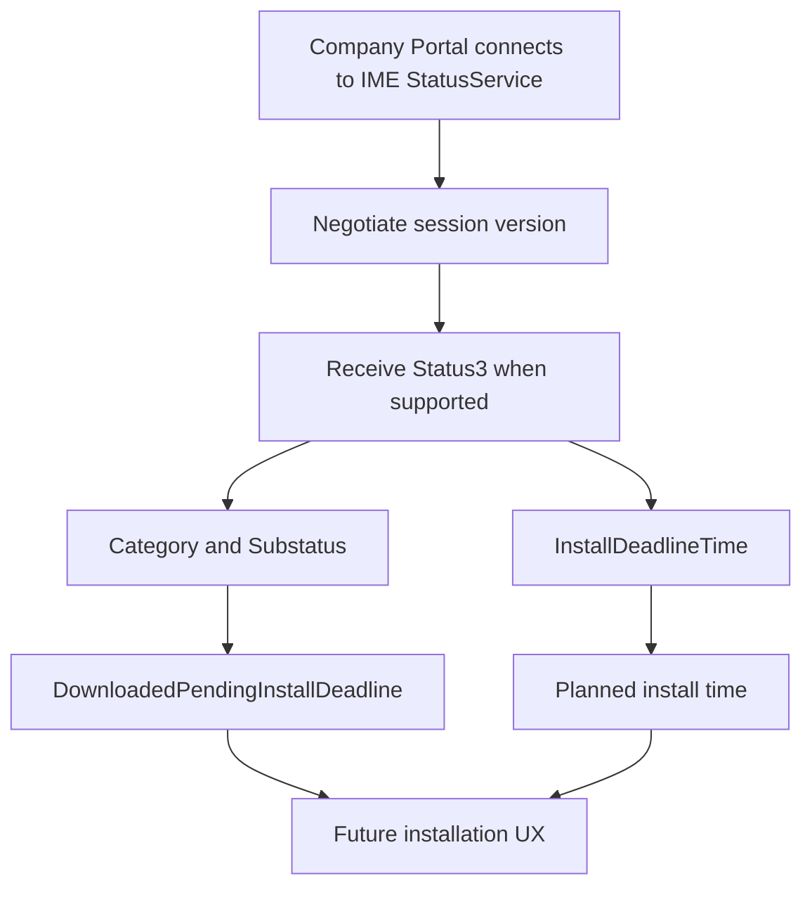
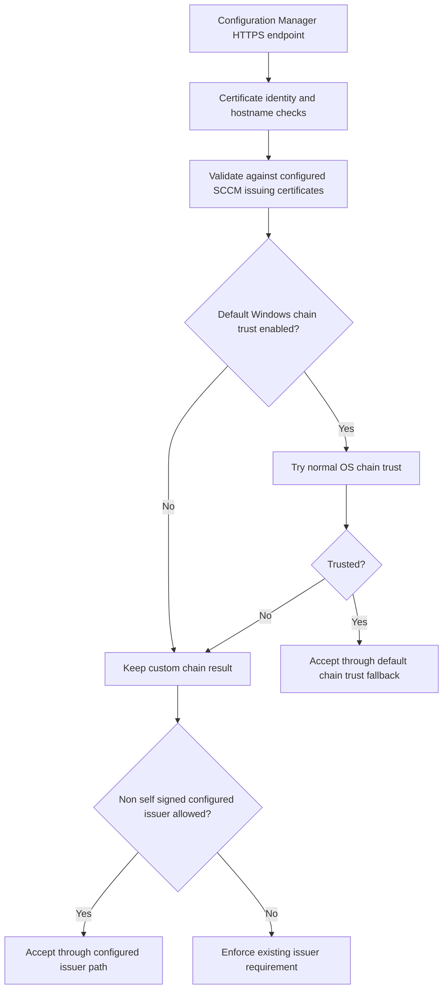

# company-portal-11.2.2037.0-to-11.2.2044.0

## Scope

This report compares Company Portal `11.2.2037.0` with `11.2.2044.0` using the original APPXBUNDLE packages and the extracted x64 APPX payloads.

The comparison includes package inventory, APPX manifest changes, SHA 256 comparison, `CompanyPortal.dll`, compiled XAML runtime metadata, `resources.pri`, printable strings, and managed bridge/service assemblies. `CompanyPortal.dll` is .NET Native, so structural evidence and shipped strings are used rather than claiming normal managed IL control flow.

Presence of a code path does not prove that it is enabled for every tenant because Company Portal uses service configuration, feature flighting, and negotiated service contracts.

## Executive summary

`11.2.2044.0` restores most of the feature lines removed in `2037`.

The newer IME StatusService contract and future installation deadline UX return. The advanced Sidecar CUE admission and reconciliation model returns. The Configuration Manager HTTPS and certificate hardening returns. The `2035` search/accessibility XAML shape returns, and the Windows minimum version is lowered again to `10.0.17763.0`.

EAM/Recast was never removed, so it simply continues through `2044`.

`2044` is also more than a restore. Compared with `2035`, `CompanyPortal.dll` is another `56,320` bytes larger. The clearest additional work is in Configuration Manager certificate trust, where `2044` adds a default Windows chain trust fallback and support for a configured non self signed issuer when the relevant flight permits it.

## Package level changes

| Property | 11.2.2037.0 | 11.2.2044.0 |
| --- | ---: | ---: |
| APPXBUNDLE size | `78,025,583` | `79,041,353` |
| x64 APPX size | `19,810,385` | `20,086,256` |
| x64 extracted size | `53,906,137` | `54,619,391` |
| x64 file count | `271` | `271` |
| Added files | `0` | `0` |
| Removed files | `0` | `0` |
| Files with changed SHA 256 |  | `65` |
| `CompanyPortal.dll` | `39,310,336` | `40,012,288` |
| `resources.pri` | `969,216` | `970,728` |
| `Core/Core.xr.xml` | `79,487` | `79,565` |
| `Navigation/Navigation.xr.xml` | `11,276` | `12,030` |
| Windows minimum version | `10.0.18362.0` | `10.0.17763.0` |

APPXBUNDLE SHA 256:

`11.2.2037.0`: `7369c76bfdd443807e2086b6b6d050f81df344aeacbbd2487b28eb19cc361faa`

`11.2.2044.0`: `49aa1d4eba1e8287f9b98a93fc7ae49232aad112581c0935ef164a0699817bd9`

`CompanyPortal.dll` SHA 256:

`11.2.2037.0`: `e71294278c86630e025e96dce8a1fb0069152ca2d20f678c8ab0ff3591fb8dff`

`11.2.2044.0`: `8a7fe1277955359f3fd5694ce90a6d1a14a1f3bd9b1e5098ed0f56bf80b7de32`

## What returns in this release

| Area | 2037 | 2044 |
| --- | --- | --- |
| EAM/Recast | Present | Retained |
| Sidecar CUE admission/reconcile | Removed | Restored |
| Status3 and deadline | Removed | Restored |
| ConfigMgr security hardening | Removed | Restored and expanded |
| Search/accessibility XAML line | Rolled back | Restored |
| Windows minimum | `18362` | `17763` |

## 1. Status3 and deadline aware app status return

The bundled IME status library returns from `1.52.202.0` to `1.106.52.0` and is byte identical to the copy shipped in `2035`.

The restored contract includes:

```text
AppInstallStatus3
AppInstallStatusCategory
AppInstallSubstatus
NegotiateSessionVersionAsync
InstallDeadlineTime
DownloadedPendingInstallDeadline
WinGetPackageNotFound
WinGetProcessTimeout
```

`IntuneManagementExtensionBridge.exe` regains the corresponding session negotiation and Status3 members. The shared app service contract regains `NegotiatedSessionVersion`.

The future installation resources also return:

```text
Downloaded for future installation
Downloaded successfully, will be installed on {0:g}
```

### Restored status flow



This is a direct restoration of the `2035` status feature line rather than a new contract generation.

## 2. Advanced Sidecar CUE admission and reconciliation return

`2044` again contains the `2035` admission architecture:

```text
SidecarOnboardingAdmitted
SidecarOnboardingAdmissionOwnerV1
TryAdmitSidecarOnboardingAsync
TryResumePersistedSidecarOnboardingAsync
RefreshDeviceAndValidatePersistedSidecarOnboardingAsync
RevalidateSidecarOnboardingAdmissionWithEcsAsync
WaitForAuthenticatedConfigAsync
ShouldKeepCurrentPageForCueLaunch
OnboardingReconcileOutcome
```

The exact Sidecar marker requirement returns as well, together with the `[Onboarding][Reconcile]` required app recheck loop.

The original `CueOnboardingAutoLaunch` task remains unchanged. So `2044` restores the richer Sidecar admission logic around the existing startup architecture.

## 3. Configuration Manager security hardening returns

The `2035` controls return:

```text
BlockConfigurationManagerHttpsToHttpFallback
RestrictConfigurationManagerAppDescriptionLinksToWebSchemes
DisableCcmCertificateIdentityValidation
CcmIssuingSslValidator
ConfigurationManagerCredentialWithheldOverInsecureChannel
ConfigurationManagerFallbackRegistrationBlocked
```

The package again contains explicit handling for HTTPS downgrade prevention, hostname validation, and validation against configured SCCM issuing certificates.

## 4. Configuration Manager certificate trust expands beyond 2035

This is the clearest additional `2044` work rather than simply a restore.

New names include:

```text
EnableDefaultChainTrust
IsDefaultChainTrustEnabled
TryDefaultChainTrustFallback
ValidateChainTrustToRootWithDetails
SuccessDefaultChainTrustFallback
DisableSelfSignedCertRequirement
TerminalCertificateNotSelfSigned
TrustedViaNonSelfSignedIssuer
```

New diagnostics include:

```text
ConfigMgr default OS chain trust accepted the certificate after ...
ConfigMgr default OS chain trust rejected the certificate after ...
ConfigMgr SSL custom chain accepted through a configured non-self-signed issuer because the self-signed certificate requirement flight is enabled.
SSL certificate validation failed. An SCCM issuing certificate could not be decoded.
```

### Certificate decision shape



This suggests Microsoft was broadening the accepted certificate trust model while keeping explicit controls around the fallback behavior.

## 5. EAM/Recast continues unchanged

The EAM/Recast service library introduced in `2035` remains byte identical across `2035`, `2037`, and `2044`.

The `Include all apps` path, `EamStatic`, `EamAutoUpdate`, `EamRecast`, and the Recast count logic therefore continue without a new structural change in this release.

## 6. The 2035 search and accessibility XAML line returns

`Core/Core.xr.xml` and `Navigation/Navigation.xr.xml` in `2044` are byte identical to their `2035` counterparts.

That restores the search and accessibility metadata removed in `2037`, including the SearchBox state resources and related XAML metadata.

`resources.pri` in `2044` is only `80` bytes larger than in `2035`, and no separate major new user facing page can be identified from the printable resource delta.

## 7. The Windows compatibility floor is lowered again

The manifest changes from:

```text
MinVersion="10.0.18362.0"
```

to:

```text
MinVersion="10.0.17763.0"
```

This restores the same minimum version used by `2035`.

## 8. What stays unchanged

The base CUE startup task remains. The EAM/Recast feature remains. The existing bridge app services remain. No package file is added or removed.

The release is therefore mostly a restoration and expansion of code paths inside the existing Company Portal architecture.

## 9. Bridge components

The bridge binaries are rebuilt, but no functional BridgeLauncher code change was identified. Detailed BridgeLauncher hashes, framework metadata, and signing observations are kept in the separate `BridgeLauncher-history-11.2.1952.0-to-11.2.2044.0.MD` report.

## Bottom line

`11.2.2044.0` restores the richer IME app status and deadline feature, restores the advanced Sidecar CUE admission/reconciliation model, and restores the Configuration Manager security hardening removed in `2037`. It then goes further by expanding Configuration Manager certificate trust with a default Windows chain trust fallback and a controlled configured issuer path. EAM/Recast continues unchanged throughout.
